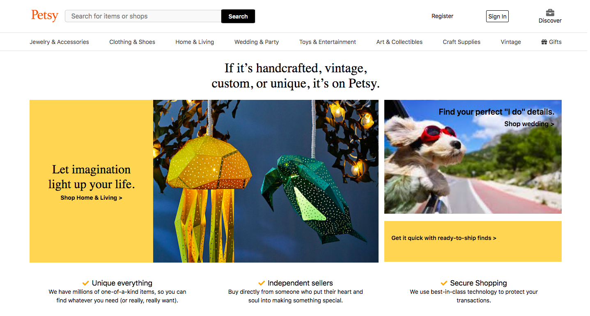
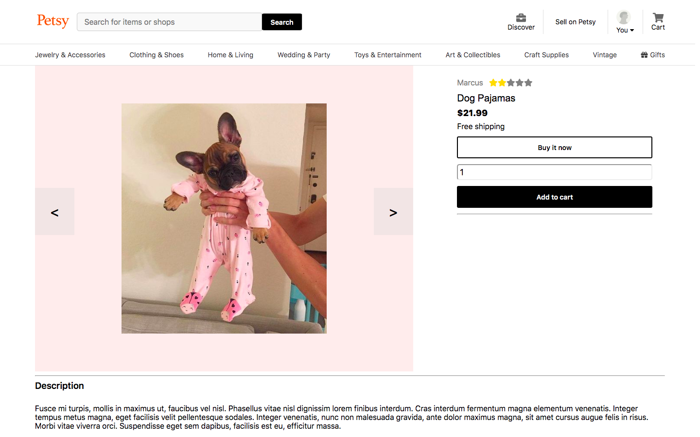

# Petsy

Petsy is a marketplace for unique and handcrafted pet goods inspired by Etsy. Users can browse/create product listings, purchase products, and create reviews.

[Check out the live site!](https://petsy-aa.herokuapp.com/#/)

## Technologies

- React
- Redux
- Ruby on Rails
- JavaScript
- JQuery
- PostgreSQL
- Amazon Web Services S3
- HTML
- CSS

## Features
### _User Log-in, Registration, and Demo Account_

Users can create an account and log in, or test the site using a demo account. Accounts each have their own reviews, shopping carts, and listings which persist across sesions.

### _Product Search Bar and Produst Listing Index_

Users can search for items by name using the search bar, and see an index of all results. Alternatively, users can look through all products.

### _Reviews_

Users can leave reviews on products and see the product's rating update immediately.

### _Cart_

Users can add items to their cart, and demo payment.

## Things to be implemented in the future
### Chat with customer support
  Use action cables to have live chat with a customer support representative
### Store profiles
  Have store profile pages where you can see all items that belong to a specific store, as well as other information about the store(average product rating, number of products sold, when the store was established).
### Categories
  Have categories for each item and build the megadropdown menu featured on Etsy.
